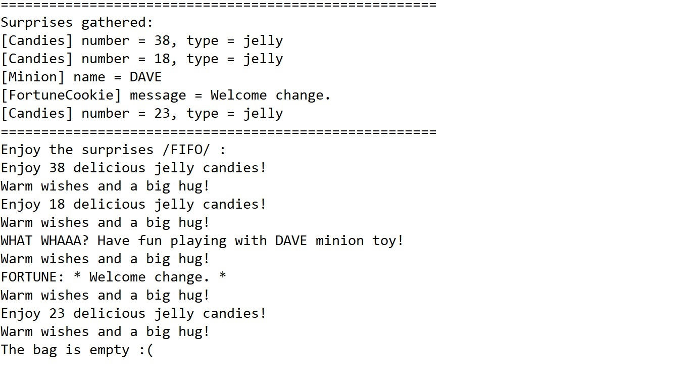
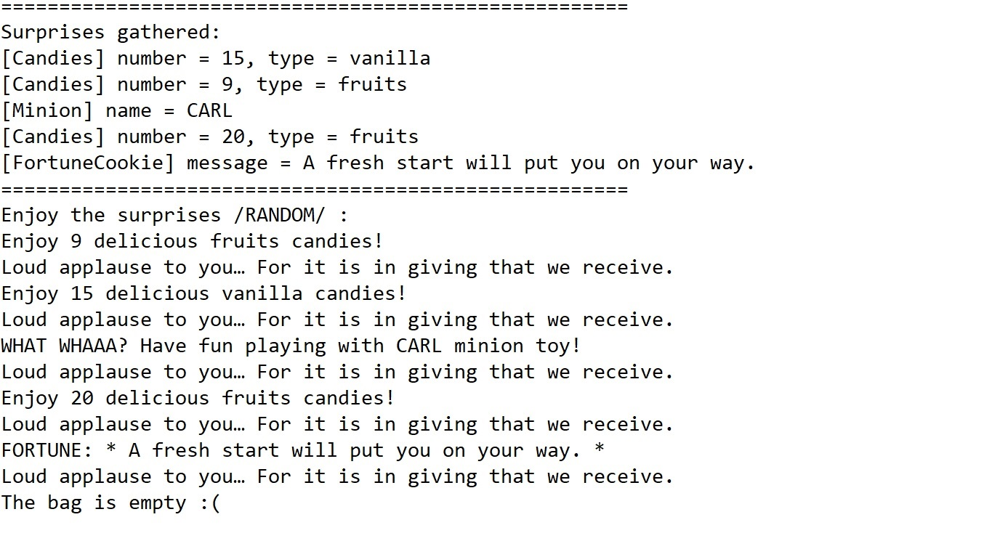
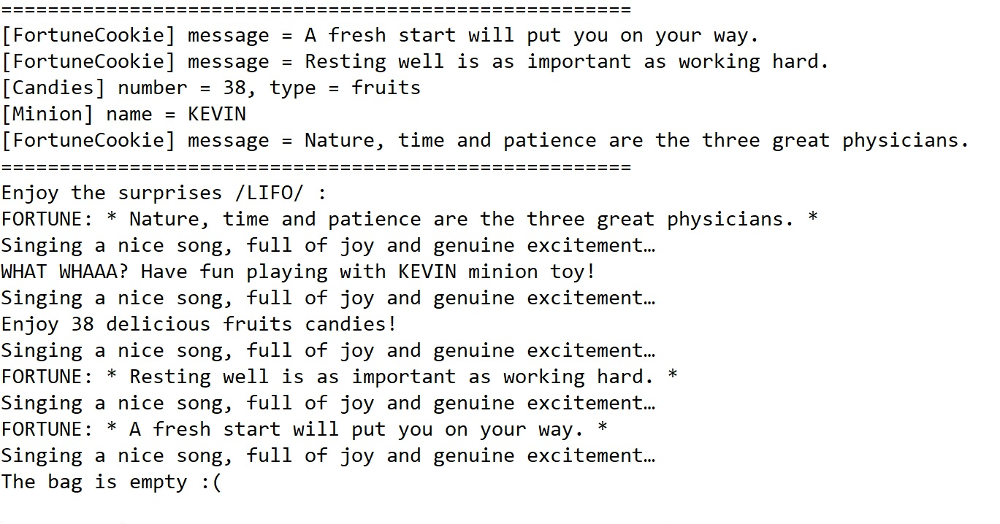

# Give surprises
The project consists of an application designed to manage a set of surprises.  
The application represents a generic system that is able to:
- use multiple types of surprises, through the implementation of a common interface
- implement various algorithms for storing and giving surprises
- use a powerful, random mechanism for generating a set of surprises

## OOP principles and notions
The program is based on the following OOP principles and notions:
- functionality reusability through inheritance
- data and functionality hiding through encapsulation
- wrapper methods and delegation
- class architecture design
- code structuring based on applicability, methods and classes
- using uppcasting in order to work with different types of objects  
- the design and using of interfaces in working with different components

## Architecture
### Surprises
There are three types of surprises, each type implementing the common interface ISurprise, which allows to "open" the surprise:
- Fortune cookie message
- Candies
- Minion toy

The surprises are generated in a random manner, using the static method generate().

| Surprise | Algorithm to generate the surprise |
| :-:      |  --------------------------------- |
| FortuneCookie | The class contains an array of 20 fortune cookie messages. When generate() is called, the method generates a random number and chooses a message from the array accordingly.|
| Candies | The class contains an array with several types of candies. When generate() is called, the method generates two random numbers - one corresponding to the type of candy and the second one - representing the number of candies.|
| MinionToy | The types of minions are stored in an enum. Each minion is chosen in order, with the use of an internal counter.|

### Storing surprises
The surprises are stored in three different types of containers. 
- LIFO bag
- FIFO bag
- Random bag  

The containers will define the storage method and especially the order in which the surprises will be distributed. The containers implement the common interface IBag, which defines their behaviour - the actions of adding and removing surprises to/from a bag, returning the size of the bag as well as the empty status of the bag.

### Creating surprises
A special class GatherSurprises is used to generate a random set of surprises. The behaviour of the class is similar to people randomly collecting and putting together bags of treats.
Two methods of randomly generating surprises are being used:
- the one already implemented, which randomly generates a surprise of a certain type
- a random number used to choose the type of surprise generated at each step  

GatherSurprises does not allow creating new instances, nor inheritance, its implementation being final and having all methods being static.
The class only implements two static methods, to generate either a random array of surprises or just one random surprise.

### Creating the containers
The containers are created using the factory design pattern. The common interface used for making the containers is IBagFactory.  
The existence of an interface allows for several bag factories to be created depending, for example, on the type of collection being used. In the project we are using only ArrayList to store the surprises, therefore is need for only one BagFactory.  
Bags will be created according to their type (LIFO, FIFO, Random).

### Sharing the surprises
In order to share the surprises the AbstractGiveSurprises class is defined.
The AbstractGiveSurprises class is extended by three classes: GiveSurpriseAndApplause, GiveSurpriseAndSing and GiveSurpriseAndHug, whose behaviours are consistent with their names.

## Example of running the application

